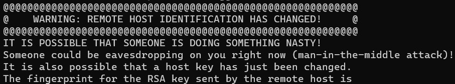

# SSH Honeypot

This is a simple SSH honeypot made using Python and Bash. This honeypot is made to run on a Linux machine.

## Sections
[Design](#design)

[How to Use](#how-to-use)

[References](#references)

## Design
### Log Format
#### Password Authentication Logs
ip_address:\<ip_address\>,latitude:\<latitude\>,longitude:\<longitude\>,country:\<country\>,username:\<username\>,password:\<password\>,date:\<date\>,time:\<time\>

#### Public Key Authentication Logs
ip_address:\<ip_address\>,latitude:\<latitude\>,longitude:\<longitude\>,country:\<country\>,username:\<username\>,key_type:\<key_type\>,fingerprint:\<fingerprint\>,base64:\<base64\>,bits:\<bits\>,date:\<date\>,time:\<time\>

## How to Use
Clone this repository onto your machine:

```bash
git clone https://github.com/ManuelDogbatse/ssh_honeypot.git && cd ssh_honeypot
```

Run the 'setup_environment.sh' script and follow the instructions:

```bash
chmod 755 ./setup_environment.sh
./setup_environment.sh
```

By default, the IP address is the default route and the port number is 22. For the app.ipgeolocation.io API key used to get the geolocation of the honeypot's attackers, go to [ipgeolocation's website](https://app.ipgeolocation.io) and sign up. Then on the dashboard, generate a new API key and paste it in the script as the input.

> NOTE - If the script fails in any way, you can also manually modify the ```.env``` file, which has all the environment variables used by the honeypot.

Start the honeypot server (see [Docker Engine installation](https://docs.docker.com/engine/install/) to download Docker):

```bash
docker compose up -d --build
```

Your logs will appear in the ```logs``` directory, named ```ssh_password_logins.log``` and ```ssh_public_key_logins.log```.

You can make changes to the ```format_logs.sh``` file in the ```log_formatter``` directory to write reformat all the previously made logs, or test the honeypot without using geolocation. See the comments in the file for more information.

## Connecting to the honeypot

To test the honeypot, you can connect to the honeypot the same way you would connect to a real SSH server:

```bash
ssh -p <port> <ip_address>
```

If you have warning connecting to the SSH server like this:

<p align="center">

</p>

Make sure you are connecting to the correct IP address, and type this in your SSH client console to reset the known_host key stored for the honeypot SSH server:

```bash
ssh-keygen -R [<ip_addr>]:<port>
```

## References
- [0xdf - Creating a SSH Honeypot with Python](https://www.youtube.com/watch?v=HO1h57CiF98&t=435s)
- [How to build an SSH honeypot in Python and Docker - Part 1](https://securehoney.net/blog/how-to-build-an-ssh-honeypot-in-python-and-docker-part-1.html)
- [Paramiko Documentation](https://docs.paramiko.org/en/latest/)